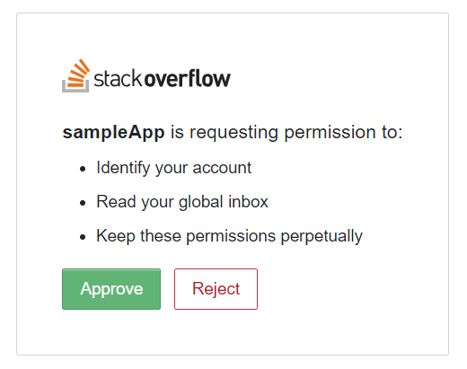

Notifying Comments at Stackoverflow by Email
=====

This is a script for sending an email when users got comments at Stackoverflow. I had wished I could get an email when I got a comment at Stackoverflow. Although I investigated about this, it seems that I can get the email every 3 hours.[Ref.](#References) For this situation, I wished I could get it much earlier. I thought that this can be achieved using GAS and Stack Exchange API. So I created this script. The features of this script are as follows.

1. This script retrieves items in Inbox using Stack Exchange API v2.2 and send an email when new unread items are included in the Inbox. The inbox includes the comments from all sites including Stackoverflow and so on.
1. Comments from the time that this script is run the last time to the current time that this script is run are retrieved as new comments.
1. After it installed this script, you can check the comments with the fixed intervals by installing as the time-driven trigger.

Various information can be retrieved using Stack Exchange API. So I would like to create the applications which are useful for SO users in the future.

# Usage
This script is Google Apps Script and uses Stack Exchange API v2.2. So please do the following flow to use this script.

## 1. Retrieve access token for using Stack Exchange API
1. [Register an application at stackapps.com.](https://stackapps.com/apps/oauth/register)
    - Input "Application Name", "Description", "OAuth Domain" and "Application Website".
        - As a sample credential, I inputted them as "sampleApp", "This is a sample app.", **"localhost"** and "sample".
        - In order to use as the redirect uri, please set **"localhost"** to "OAuth Domain".
    - Copy "Client Id", "Client Secret" and "Key".
1. Authorize the scopes.
    - Please create the following URL and access it using your browser. Please set your client_id.
    - ``https://stackexchange.com/oauth?client_id=#####&scope=no_expiry%20read_inbox&redirect_uri=http://localhost``
        - In this script, "no_expiry" and "read_inbox" are used as the scopes.
    - When the created URL is opened by your browser, please click "Approve" as follows. 
    - Copy the code ``### code ###`` from URL of browser like ``http://localhost/?code=### code ###``.
1. Retrieve access token using "Client Id", "Client Secret" and "Code". Please run the following curl command. By this, you can retrieve access token like ``access_token=#####``.
    - This access token has no expiration time because "no_expiry" is included in the scopes. So you can continue to use this access token.

~~~bash
curl \
    -d "client_id=#####" \
    -d "client_secret=#####" \
    -d "code=#####" \
    -d "redirect_uri=http://localhost" \
    "https://stackexchange.com/oauth/access_token"
~~~

## 2. Install GAS script
1. Copy and paste the script to your script editor.
    - In order to open the script editor, visit [script.google.com](https://script.google.com/), and click "Start Scripting". By this the script editor is opened. (You'll need to be signed in to your Google account.) If this is the first time you've been to script.google.com, you'll be redirected to a page that introduces Apps Script. Click Start Scripting to proceed to the script editor. ([Ref.](https://developers.google.com/apps-script/overview))
1. Input "Key", "accessToken" and "your email" to JSON object of "account" in "run()". email is used for sending the notification, when you received comments.
1. Run "run()".

**When [a time-driven triggers](https://developers.google.com/apps-script/guides/triggers/installable#managing_triggers_manually) is installed to "run()", this script checked the comments and send email when new comments are retrieved by the cycle set by the time-driven triggers.**

# Note :
This is a simple script. I use this script. But if you want to modify, please do it for your environment. If you have questions about this script, feel free to tell me.

# References :
- [Email notifications in stackoverflow](https://meta.stackoverflow.com/questions/270408/email-notifications-in-stackoverflow)
- [Getting email notifications when comments or answers are posted](https://meta.stackexchange.com/questions/142192/getting-email-notifications-when-comments-or-answers-are-posted)
- [Instant e-mail notifications of answers to questions](https://meta.stackexchange.com/questions/6557/instant-e-mail-notifications-of-answers-to-questions)
- [How to receive email for responses to posts on Stack Overflow](https://meta.stackexchange.com/questions/107342/how-to-receive-email-for-responses-to-posts-on-stack-overflow)
- [Stack Exchange API v2.2](https://api.stackexchange.com/docs)

-----

# Licence
[MIT](LICENCE)

# Author
[Tanaike](https://tanaikech.github.io/about/)

If you have any questions and commissions for me, feel free to tell me.

# Update History
* v1.0.0 (July 13, 2018)

    Initial release.

[TOP](#TOP)
